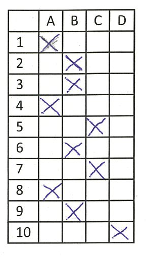
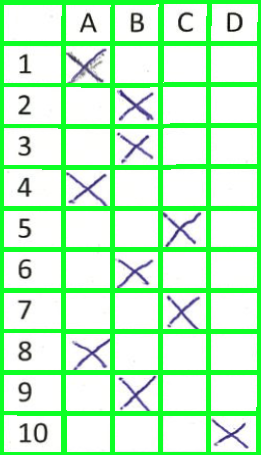
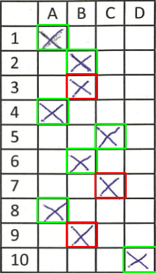
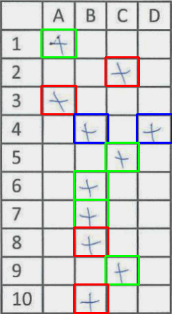
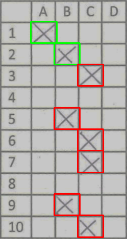
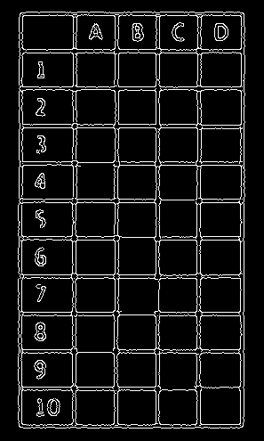

# OMR MCQ Automated Grading System

---

## Introduction

- Simplifies and streamlines MCQ grading process
    - Uses image processing techniques and computer vision algorithms
- Automatically detects and extracts MCQ grids from scanned answer sheets
    - Recognizes and marks correct and incorrect answers
- Handles multiple crosses and empty rows
- Saves time, reduces human errors, and increases efficiency

---
## Features
1. Automatic detection and extraction of MCQ grids

  

    
     
    Original
  

  

    
     
    Detected Grid
  

---
## Features
2. Recognition and marking of correct and incorrect answers

  

    
     
    Original
  

  

    
     
    Checked
  

---
## Features
3. Handling multiple crosses and empty rows

  

    
     
    Multiple Crosses
  

  

    
     
    Empty Row
  

---
## Features
4. Exporting results as marked images and `.csv`

| Image ID | Total Questions Answered | Correct | Wrong | Empty | Percentage |
| -------- | ------------------------ | ------- | ----- | ----- | ---------- |
| 0        | 10                       | 7       | 3     | 0     | 70.0       |
| 1        | 10                       | 2       | 8     | 0     | 20.0       |
| 2        | 10                       | 3       | 7     | 0     | 30.0       |
| 3        | 10                       | 4       | 6     | 0     | 40.0       |
| 4        | 8                        | 2       | 6     | 2     | 20.0       |
| 5        | 10                       | 2       | 8     | 0     | 20.0       |
| 6        | 8                        | 2       | 6     | 2     | 20.0       |
| 7        | 10                       | 5       | 5     | 0     | 50.0       |
| 8        | 10                       | 2       | 8     | 0     | 20.0       |
| 9        | 10                       | 3       | 7     | 0     | 30.0       |
| 10       | ...                      | ...     | ...   | ...   | ...        |

---
## Workflow
### 1. Image preprocessing

- Grayscale conversion
    - `cv.cvtColor(image, cv.COLOR_BGR2GRAY)`
- Thresholding
    - `cv.threshold(gray_doc, lower_bound, 255, cv.THRESH_BINARY_INV)`
- Contour detection
    - `cv.findContours(threshold, cv.RETR_EXTERNAL, cv.CHAIN_APPROX_SIMPLE)`
    - Filtering horizontal and vertical contours

---
## Workflow
### 1. Image preprocessing

    

        
         
        Preprocessed
    

---
## Workflow
### 2. Cell extraction from the Grid

- Looping through contours and calculating the bounding rectangle
- Creating the grid using horizontal and vertical contours
- Extracting cells using contour coordinates

    

        
         
        Extracted Cell
    

---
## Workflow
### 3. Answer marking
- Cross detection using threshold and ratio of white to black pixels
- Coloring cells based on answer correctness
  - Green: Correct
  - Red: Incorrect
  - Blue: Multiple crosses

---

## Demo

---

Thank you for your attention!
